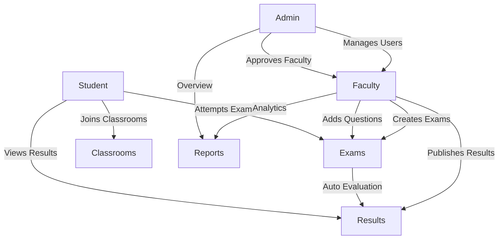

# EduSphere – Online Examination System

<div align="center">


**A modern, full-stack online examination platform for educational institutions**

[](https://www.python.org/)
[](https://flask.palletsprojects.com/)
[](LICENSE)

</div>

---

## Table of Contents

- [Overview](#overview)
- [Features](#features)
- [Technology Stack](#technology-stack)
- [Project Structure](#project-structure)
- [Installation](#installation)
- [Configuration](#configuration)
- [Usage](#usage)
- [Deployment](#deployment)
- [Default Credentials](#default-credentials)
- [Contributing](#contributing)
- [License](#license)

---

## Overview

EduSphere is a comprehensive online examination system designed to automate and streamline the examination process for educational institutions. The platform provides role-based access control for Admins, Faculty, and Students, enabling efficient exam management, automatic evaluation, result generation, and detailed performance analytics.

Built with Flask, SQLite, and modern web technologies, EduSphere offers a secure, scalable, and user-friendly solution for conducting online assessments.

---

## Features

### 🔐 Authentication & Authorization

- Secure user registration and login system
- Role-based access control (Admin, Faculty, Student)
- Password hashing using Werkzeug
- Session management with timeout enforcement
- Faculty approval workflow for new registrations

### 👨‍💼 Admin Module

- Comprehensive dashboard with real-time statistics
- User management (add, edit, delete users)
- Faculty approval system
- Activity log monitoring
- Advanced reporting and analytics
- Classroom and exam oversight

### 👨‍🏫 Faculty Module

- Create and manage exams with flexible settings
- Question bank management
- Add/edit/delete questions with multiple choice support
- Classroom management and student enrollment
- Exam launch and result publishing
- Performance analytics and student insights
- Archive center for old exams and classrooms

### 🎓 Student Module

- View available exams and exam schedules
- Attempt online exams with timer functionality
- Auto-save feature for in-progress exams
- View published results with detailed feedback
- Performance analytics and progress tracking
- Classroom enrollment via unique codes

### 📊 Reports & Analytics

- Performance reports with visualizations
- Subject-wise and classroom-wise analytics
- Top and bottom performer identification
- Export reports to CSV and PDF
- Filter by student, subject, classroom, and date range
- Pass/fail analysis with customizable thresholds

---

## Technology Stack

### Backend

- **Python 3.8+** - Core programming language
- **Flask 3.0** - Web framework
- **SQLite** - Database management
- **Werkzeug** - Password hashing and security
- **python-dotenv** - Environment variable management

### Frontend

- **HTML5** - Markup
- **CSS3** - Styling
- **Bootstrap 5** - Responsive UI framework
- **Chart.js** - Data visualization
- **JavaScript** - Client-side interactivity

### PDF Generation

- **FPDF2** - PDF report generation
- **ReportLab** - Advanced PDF creation with formatting

---

## Project Structure

```text
EduSphere/
│
├── app.py                      # Main Flask application
├── requirements.txt            # Python dependencies
├── .env.example               # Environment variables template
├── .gitignore                 # Git ignore patterns
├── README.md                  # Project documentation
│
├── instance/                  # Instance-specific files
│   └── database.db           # SQLite database (created at runtime)
│
├── static/                    # Static assets
│   ├── css/
│   │   └── style.css         # Main stylesheet
│   ├── js/
│   │   └── theme-manager.js  # Theme management script
│   ├── images/
│   │   └── logo.png          # Application logo
│   └── uploads/
│       └── profiles/         # User profile pictures
│
└── templates/                 # Jinja2 templates
    ├── components/           # Reusable components
    │   └── base.html        # Base template
    ├── admin/               # Admin-specific pages
    ├── auth/                # Authentication pages
    ├── errors/              # Error pages
    ├── faculty/             # Faculty-specific pages
    └── student/             # Student-specific pages
```

---

## Installation

### Prerequisites

- Python 3.8 or higher
- pip (Python package manager)
- Git (optional, for cloning)

### Clone the Repository

```bash
git clone https://github.com/yourusername/EduSphere.git
cd EduSphere
```

### Create Virtual Environment (Recommended)

```bash
# Windows
python -m venv venv
venv\Scripts\activate

# macOS/Linux
python3 -m venv venv
source venv/bin/activate
```

### Install Dependencies

```bash
pip install -r requirements.txt
```

### Configure Environment Variables

```bash
# Copy the example environment file
copy .env.example .env  # Windows
cp .env.example .env    # macOS/Linux

# Edit .env with your configuration
# Set a secure SECRET_KEY
```

### Initialize the Database

The database will be automatically created on first run. No manual initialization is required.

---

## Configuration

### Environment Variables

Create a `.env` file in the project root with the following variables:

```env
# Flask Configuration
SECRET_KEY=your-secret-key-here-change-in-production
FLASK_ENV=development
FLASK_DEBUG=1

# Database Configuration
DATABASE_URL=sqlite:///instance/database.db

# Session Configuration
SESSION_TIMEOUT=3600

# Upload Configuration
MAX_CONTENT_LENGTH=16777216
UPLOAD_FOLDER=static/uploads/profiles

# Application Configuration
APP_NAME=EduSphere
APP_URL=http://localhost:5000
```

### Security Notes

- **Always** change the `SECRET_KEY` in production
- Use a strong, randomly generated secret key
- Set `FLASK_DEBUG=0` in production
- Use environment-specific database configurations

---

## Usage

### Development Server

```bash
python app.py
```

The application will be available at `http://localhost:5000`

### Accessing the Application

1. Open your browser and navigate to `http://localhost:5000`
2. Log in with default credentials (see below)
3. Follow the on-screen instructions to set up your institution

---

## Deployment

### Render Deployment

1. **Push to GitHub**
   ```bash
   git add .
   git commit -m "Initial commit"
   git push origin main
   ```

2. **Create Render Account**
   - Sign up at [render.com](https://render.com)
   - Connect your GitHub repository

3. **Configure Web Service**
   - Select "Web Service"
   - Build Command: `pip install -r requirements.txt`
   - Start Command: `python app.py`
   - Add Environment Variables from `.env.example`

4. **Deploy**
   - Click "Deploy Web Service"
   - Wait for deployment to complete

### Manual Deployment (Gunicorn)

```bash
# Install Gunicorn
pip install gunicorn

# Run with Gunicorn
gunicorn -w 4 -b 0.0.0.0:5000 app:app
```

### Docker Deployment (Optional)

Create a `Dockerfile`:

```dockerfile
FROM python:3.9-slim

WORKDIR /app
COPY requirements.txt .
RUN pip install --no-cache-dir -r requirements.txt

COPY . .

EXPOSE 5000
CMD ["python", "app.py"]
```

Build and run:

```bash
docker build -t edusphere .
docker run -p 5000:5000 edusphere
```

---

## Default Credentials

### Admin Account

- **Email:** `admin@mail.com`
- **Password:** `admin`
- **Role:** Admin

⚠️ **Important:** Change the default admin password immediately after first login!

---

## System Workflow



---

## Security Features

- **Password Hashing** - All passwords are hashed using Werkzeug's security functions
- **Role-Based Access Control** - Strict separation of admin, faculty, and student privileges
- **Session Management** - Secure session handling with configurable timeouts
- **Duplicate Submission Prevention** - Prevents multiple exam submissions
- **SQL Injection Protection** - Parameterized queries throughout the application
- **CSRF Protection** - Built-in Flask CSRF protection enabled

---

## Future Improvements

- [ ] Email notifications for exam schedules and results
- [ ] Real-time chat support for students
- [ ] Mobile application (React Native/Flutter)
- [ ] Integration with learning management systems (LMS)
- [ ] Advanced question types (essay, coding, drag-and-drop)
- [ ] Proctoring features (webcam monitoring, tab detection)
- [ ] Multi-language support
- [ ] API for third-party integrations

---

## Contributing

Contributions are welcome! Please follow these steps:

1. Fork the repository
2. Create a feature branch (`git checkout -b feature/AmazingFeature`)
3. Commit your changes (`git commit -m 'Add some AmazingFeature'`)
4. Push to the branch (`git push origin feature/AmazingFeature`)
5. Open a Pull Request

---

## License

This project is licensed under the MIT License - see the [LICENSE](LICENSE) file for details.

---

## Support

For support, please open an issue in the GitHub repository or contact the development team.

---

<div align="center">

**Built with ❤️ for Education**

</div>
